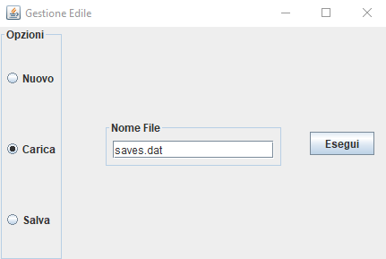
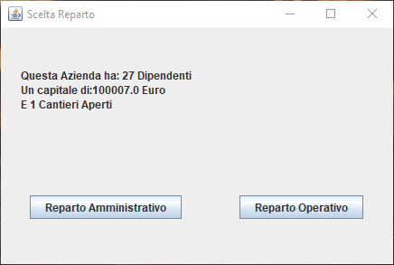

# Progetto-Gestione-Edile
Questo progetto è stato realizzato come obiettivo del corso di [Programmazione Orientata agli Oggetti](https://docenti.unisa.it/004821/didattica?anno=2019&id=511548&cId=9999-2017&pId=MODULO_3*RESTO_0*S1) dell'[Università degli studi di Salerno](https://www.unisa.it/).
La traccia richiedeva lo sviluppo di un software per la gestione di un'azienda edile con tutte le sue componenti utilizzando un linguaggio Object Oriented, in questo caso è stato utilizzato Java.
Il progetto è fornito di opportuna documentazione javadoc consultabile [qui](https://atdepo.github.io/info-edile.io/) e di un esempio di popolazione inserito nel file "saves.dat". Per eseguire il programma sarà necessario eseguire il file `GestioneEdile.jar`.
## Avvio del programma
Questa è la schermata che si presenta all'avvio del programma in cui è possibile scegliere se caricare un azienda da un file,salvare l'azienda corrente su un file o crearne una nuova.

## Scelta del Reparto
In questa schermata sarà possibile **visualizzare** alcune informazioni sull'azienda che stiamo andando ad utilizzare e **scegliere** il reparto da visualizzare. Un'azienda si compone di due macro-reparti:

_**Reparto Amministrativo**_ e _**Reparto Operativo**_.

## Reparto Amministrativo

Il Reparto Amministrativo svolge le funzioni di:
* assumere e pagare i dipendenti

